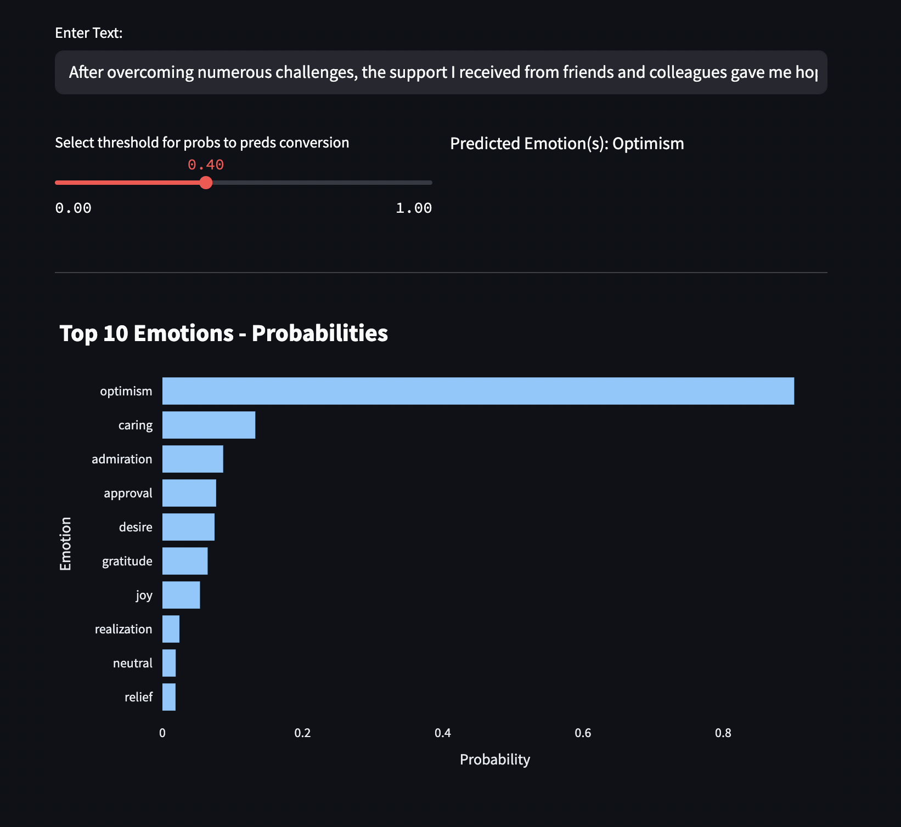
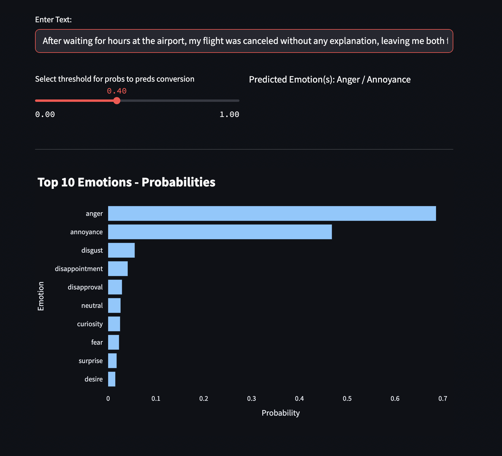
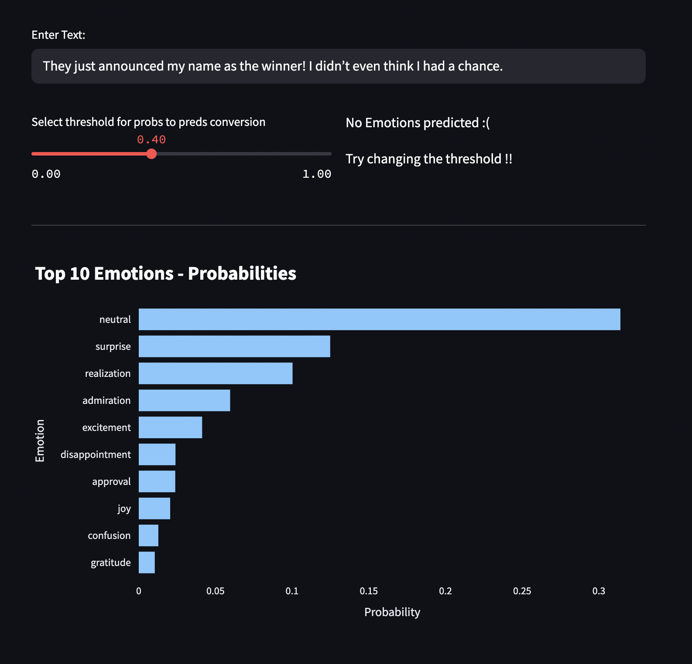

# emotions-classifier

[GoEmotions](https://paperswithcode.com/dataset/goemotions) (a multi-label classification dataset) was used for this project. After some preprocessing & criterias, only 53,951 of the original 58,011 instances are used to reduce noise. Check the [notebooks](notebooks) for more details on how the data was prepared

A BERT model was used and trained for 3 epochs. It took ~7 hours for training it on my local machine (macbook m4 pro chip). 

## To train the model locally

```bash
git clone https://github.com/eigenvextor/emotions-classifier.git

pip install -r requirements.txt

cd src

python3 train.py
```

## To run the streamlit app after training
```bash
streamlit run app.py 
```

## Some examples
Example 1: After overcoming numerous challenges, the support I received from friends and colleagues gave me hope for the future.



Example 2: After waiting for hours at the airport, my flight was canceled without any explanation, leaving me both frustrated and furious.



Example 3: They just announced my name as the winner! I didn’t even think I had a chance.

